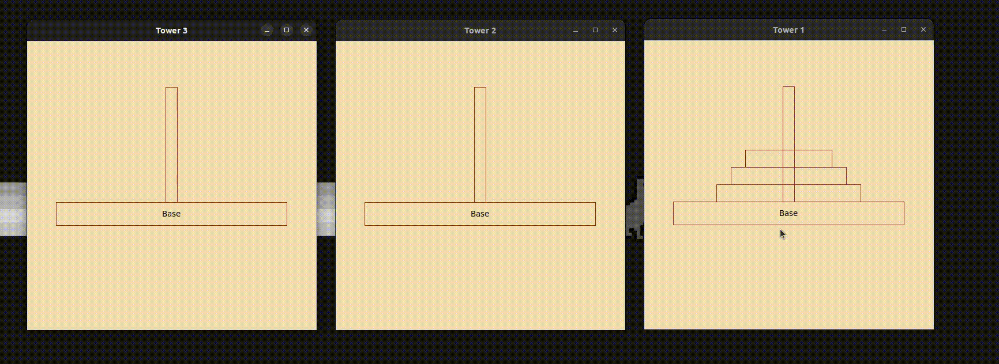
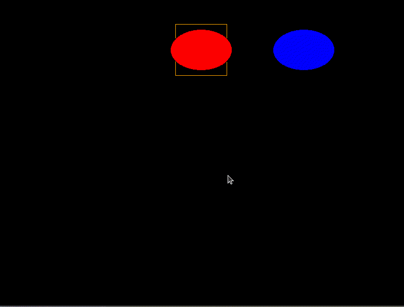

# Tema **AGL**, grupo **agl-gg04**

## Documentação extra

 - Análise semântica - [doc/semantic_check.md](doc/semantic_check.md)
 - Exemplos AGL e xAGL - [doc/examples](doc/examples/)
 - Tutorial de execução - [doc/running.md](doc/running.md)

## Estrutura do repositório
O repositório está organizado da seguinte forma:

- `doc/` contém a documentação do projeto.
- `doc/examples/` contém exemplos de código AGL e xAGL.
- `doc/examples/demo/` contém videos de demonstração da linguagem AGL.
- `src/` contém o código fonte do projeto.
- `src/tests/` contém os testes do projeto (nomeadamente análise semântica).


## Relatório


### Introdução
Este documento apresenta o relatório do projeto final do grupo AGL-gg04 para a disciplina de Compiladores do ano letivo 2023/2024, focado na criação da linguagem de programação **$AG_L$ (*animated graphics language*)**. 

Acreditamos que conseguimos cumprir todos os requisitos propostos, tendo em conta os níveis mínimo, desejável, adicional e extra.

- O objetivo geral deste trabalho foi o desenvolvimento de um ambiente de programação, constituído pela linguagem de programação $AG_L$ (*animated graphics language*) e correspondentes ferramentas de compilação, que permite a criação de programas na linguagem de programação genérica *Python3*, usando a biblioteca *tkinter*, que, quando executados, permitem a visualização, com possível animação e interação, de *gráficos 2D*.

- A linguagem assume (implicitamente) a existência de uma área de desenho, *canvas*, com dimensões ilimitadas, sobre a qual se podem instanciar (desenhar) figuras gráficas 2D. Podem também ser instanciadas vistas (*View*), que permitem capturar o estado do *canvas* numa dada região, com um determinado zoom e num determinado instante no tempo. Há um conjunto base de modelos gráficos pré-definidos, mas a linguagem possui mecanismos construtivos que permitem definir outros. As instâncias dos modelos gráficos podem, ao longo do tempo, mudar a sua posição e as suas propriedades, mas, apenas quando uma vista é *refrescada* é que as alterações são capturadas por essa vista.

- Para além disso, a linguagem principal permite a importação de elementos auxiliares através de *descrições* numa linguagem secundária, cujos elementos, em *runtime*, possam ser carregados pelo programa final. Em concreto, foi definida uma linguagem secundária, aqui designada por $xAG_L$, associada a ficheiros com a extensão *xagl*, que permite auxilar a linguagem principal $AG_L$ de alguma maneira (por exemplo, definindo modelos). O resultado desta tarefa é a gramática da linguagem $xAG_L$, a construção gramatical na linguagem $AG_L$ que permite fazer a importação de descrições em $xAG_L$, o interpretador que permite fazer o parsing de descrições $xAG_L$, e exemplos ilustrando a sua utilização. Este interpretador foi desenvolvido na linguagem destino (neste caso *Python3*) e não na linguagem de trabalho (neste caso *Java*), uma vez que a interpretação é feita em *runtime*.

**Torres de Hanoi**: demonstra a facilidade na criação de programas complexos em $AG_L$. Utilizando multiplas vistas e modelos que facilitam a criação de animações complexas. 



### Requesitos do projeto

Foram definidos 4 níveis para a realização deste projeto:

#### Nível mínimo  [<span style="color:green">DONE</span>]

  - Suporte para comentários, de linha e de bloco, tal como ilustrado no exemplos.
  - Instanciação de uma vista (*View*) sobre a área de desenho (*canvas*). As vistas devem portam as ações de *move*, *refresh*, *wait* e *close*. Neste nível, considerámos que existe apenas uma vista.
  - Instanciação dos modelos gráficos base *Dot*, *Line*, *Circle*, *Rectangle*, *Ellipse*, *Text*, *Arc*, *ArcChord* e *PieSlice*. Todos estes modelos têm implicitamente um ponto de referência, cuja localização no canvas será indicada aquando da sua instanciação. Todos os objetos gráficos devem suportar a ação de *move*. Todos os objetos gráficos possuem um conjunto de propriedades, que podem ser alteradas em tempo de execução.
  - Suporte dos tipos de dados *Integer*, *Number*, *Point*, *Vector*, *String*, e *Time* e da instanciação de objetos destes tipos. Suporte de expressões envolvendo estes tipos de dados.
  - Suporte da construção *with*.
  - Uma construção gramatical repetitiva *for*, para iterar sobre uma sequência de valores.
  - Verificação semântica no uso de variáveis e de expressões e na manipulação de propriedades.
  - Definição e implementação de uma linguagem secundária, aqui designada por $xAG_L$, associada a ficheiros com a extensão *xagl*.


#### Nível desejável  [<span style="color:green">DONE</span>]

  - Instanciação dos modelos gráficos base *Polyline*, *Spline*, *Polygon* e *Blob*. Todos estes modelos têm implicitamente um ponto de referência, cuja localização no *canvas* será indicada aquando da sua instanciação. Todos os objetos gráficos devem suportar a ação de *move*. Todos os objetos gráficos possuem um conjunto de propriedades, que podem ser alteradas em tempo de execução.
  - O tipo de dados *Boolean* e a manipulação de expressões booleanas.
  - Uma construção gramatical condicional. Neste nível, considerámos apenas a construção *if-else* com suporte para expressões booleanas, incluindo *and*, *or*, *not*, *==*, *!=*, *<*, *<=*, *>* e *>=*. Com as respetivas prioridades.
  - Uma construção gramatical repetitiva baseada em predicado (condição de término ou de continuação). Neste nível, considerámos as construções *while*, *repeat-until*.
  - Suporte para a especificação de vetores (*Vector*) em coordenadas polares.
  - A possibilidade de definição de novos modelos (associada à palavra-chave *Model*), que permita agregar instâncias de outros modelos, base ou definidos anteriomente, numa nova entidade. Todas as propriedades destes novos modelos serão definidas aquando da sua conceção. Deve ser possı́vel fazer depender as propriedades dos modelos incorporados de propriedades do modelo principal. O novo modelo poderá ser depois instanciado.
  - Suporte para estrutura de dados iterável (array, lista, ...) e de mecanismos de instanciação, acesso e manipulação dos seus elementos. Neste nível, considerámos apenas a construção de *array* (apenas aceita elementos do mesmo tipo).
  - Possibilidade de aplicar as ações move, refresh e close diretamente a uma lista de objetos.


#### Nível adicional  [<span style="color:green">DONE++</span>]

  - Suporte para a rotação de objetos gráficos. Neste nível, houve a necessidade de redefinir internamente a forma como os objetos gráficos são representados (para permitir rotação de TODOS os objetos). Considerámos também a rotação de modelos que contêm outros modelos através do seu ponto de referência.
  - Suporte para várias vistas.
  - Suporte para a operação *deepcopy*, que permite a *cópia profunda* de objetos gráficos. Facilitação na duplicação de objetos gráficos complicados.
  - Definição de palavras reservadas para a linguagem principal $AG_L$. As palavras reservadas da linguagem destino (neste caso *Python3*) **não são** um subconjunto das palavras reservadas da linguagem principal $AG_L$. (Por exemplo, a palavra *return* é uma palavra reservada da linguagem destino, mas não da linguagem principal $AG_L$).
  - O tipo de dados *Enum* e a manipulação de variáveis enumeradas.

#### Desafios  [<span style="color:green">DONE</span>]

  - Criação de uma animação interativa que permita a um utilizador resolver as torres de Hanoi.

<hr>

### Nível mínimo

> Neste nível, o nosso grupo focou-se na implementação dos requisitos mínimos, tendo em conta a instânciação de uma vista, a instânciação dos modelos gráficos base, a manipulação de tipos de dados, a construção *with*, a construção *for*, a verificação semântica e a definição e implementação de uma linguagem secundária.

#### __Instanciação e Definição | Tipos de Dados__
---
- Para instanciar um tipo de dados/objetos usa-se o operador **(:)**
- Para fazer a atribuição de algum valor usa-se o operador **(=)**
  
Neste nível, foram implementados 6 tipos principais de dados cada um com o seu **default value**:
- **Integer**: Representa um número inteiro | **Default = 0**; 
- **Number**: Representa um número inteiro ou número real | **Default = 0.0**;
```
#Instanciação e Operações

a : Integer = 3
b : Number = 2.0*a;
c : Integer = 2*3;
d : Number = 2.0*3.0;

e : Number = a + b;
f : Number = c - b;
g : Number = d / 2.0;
```  

- **String**: Sequência de caractéres | **Default = ""**;
```
nome : String = "Nome";
```
- **Point**: Representa um ponto no canvas | **Default = (0, 0)**;
- **Vector**: Representa a diferença entre dois pontos | **Default = (0.0, 0.0)**;
```
ponto : Point = (1,5);
vetor : Vector = (2,3);

ponto2 : Point = ponto + vetor;
vetor2 : Vector = vetor + vetor;

# Não é possível adicionar dois pontos
# ponto3 : Point = ponto + ponto; 

vetor3 : Vector = vetor * vetor * 4;
ponto4 : Point = ponto * 2;
```
- **Time**: Representa um valor positivo que pode ser usado em operações que envolvam tempos | **Default = 0**
```
t1 : Time = 0.8;

t2 : Time = 0.5;

t3 : Time = t1 + t2; 

t4 : Time = t1 - t2;

t5 : Time = t1 * t2; 

t6 : Time = t1 / t2; 
```

#### __Definição de uma View__
---
  Para se definir uma *View* é necessário ter em conta diversas propriedades, cada uma com um tipo e valor *default*:
  - Ox: Number = 0.0 , Oy: Number = 0.0 | O ponto do canvas do centro da janela da *View*
  - width: Integer = 201 | Número de pixéis numa linha
  - height: Integer = 201 | Número de pixéis numa coluna
  - title: String = "No title" | O título da janela
  - background: String = "black" | A cor do fundo da *View*
  
  (O operador **with** possibilita a atribuição de valores para quaisquer propriedades de um objeto na sua instanciação)

Exemplo:
```
view : View with {
  width = 601;
  height = 601;
  title = "Title for View";
  background = "blue";
}
```
A *View* suporta ações como **move** *(explicado mais á frente)*, **refresh**, **wait** e **close**

| Instrução | Definição | 
| :---: | :---: |
| ```refresh view after 100 ms``` | Atualiza a **View** após 100 milissegundos, ou seja, quaisquer alterações em objetos são mostradas após o tempo definido em milissegundos |
| ```refresh view after 10 s``` | Faz **refresh** da **View** após 10 segundos | 
| ```p : Point = wait mouse click``` | Espera um click pelo utilizador na **View** e atribui as coordenadas ao ponto **p** | 
| ```close view``` | Fecha a janela da **View** | 


#### __Definição de Objetos do Canvas__
---
Neste nível, foram desenvolvidos alguns tipos de objeto principais como:
  - **Line** : Representa uma linha reta que conecta o seu ponto de referência com outro ponto dado por um vetor *length*

(Para definir o ponto de referência de um objeto usa-se o operador **at**)
```
linha : Line at (10, 20) with {
  length = (30, 40);
  fill = "red";
}
```
- **Rectangle** : Representa um retângulo referenciado pelo seu ponto do centro e um vetor *length* a apontar para o canto superior direito a partir desse ponto
```
retangulo : Rectangle at (10, 20) with {
  length = (30, 40);
  fill = "blue";
}
```
- **Ellipse** : Representa uma elipse que é referenciada pelo seu ponto central e um vetor *length* a apontar para o canto superior direito do retangulo em que a elipse se insere
```
elipse : Ellipse at (10, 20) with {
  length = (30, 40);
  fill = "green";
}
```
- **Arc**, **ArcChord** e **PieSlice** são derivadas da **Ellipse** mas, para além da sua referência e *length*, estes tipos de objeto são definidos por um ângulo de **start** (ângulo inicial a partir do qual se vai desenhar a parte da elipse correspondente) e um **extent** (ângulo que a figura vai tomar a contar a partir do **start**)
- **Arc**: Representa o arco de uma elipse, não fechado, e pode ter como atributo a cor da sua **outline**
```
arco : Arc at (10, 20) with {
  length = (30, 40);
  start = 0;
  extent = 90;
  outline = "tomato";
}
```
- **ArcChord**: Representa o arco de uma elipse, no entanto, as suas extremidades conectam-se diretamente formando uma reta
```
arccord : ArcChord at (10, 20) with {
  length = (30, 40);
  start = 0;
  extent = 90;
  fill = "cyan";
}
```
- **PieSlice**: Representa o arco de uma elipse, no entanto, as suas extremidades conectam-se ao seu **centro** 
```
pieslice : PieSlice at (10, 20) with {
  length = (30, 40);
  start = 0;
  extent = 90;
  fill = "purple";
}
```
- **Text**: Representa um texto que pode ser colocado em qualquer lugar do canvas
```
texto : Text at (10, 20) with {
  text = "Texto";
  fill = "red";
}
```
- **Dot**: Representa um ponto no canvas
```
ponto : Dot at (10, 20) with {
  fill = "black";
}
```
#### Todos estes objetos e Views suportam a operação **move** e **with**
---

Tendo como referência o objeto seguinte:
```
objeto : Rectange at (10, 20) with {
  length = (30, 40);
  fill = "blue";
}
```

| Instrução | Definição |
| :---:     | :---:     |
| ```move objeto to (0, 0)``` | Move diretamente o **objeto** para a posição **(0,0)**|
| ```move objeto by (5, 5)``` | Move o **objeto** segundo o vetor **(5,5)**, ou seja, iria ser deslocado para **(15,25)**|
| ```with objeto do { length = (15, 20); fill = "red"; }```| Altera as propriedades do **objeto** em runtime|

#### Construção repetitiva FOR
---
O **for** é capaz de repetir as instruções dentro dele através da iteração sobre uma sequência de valores:
- **Valor inicial**;
- **Valor final** - Exclusivo, ou seja, a variável fica com o valor de **Valor final** - 1;
- **Passo** - Opcional com valor de *default* =  1;
```
# Mostra na consola de 0 a 9 de 3 em 3
for i in 0..10..3 {
  print i
}
```
### Análise Semântica
---
 - Análise semântica - [doc/semantic_check.md](doc/semantic_check.md) 

### Linguagem Secundária $xAG_L$
---
Para complementar a linguagem $AG_L$, foi desenvolvida a linguagem secundária $xAG_L$ que permite, em *runtime*, criar/usar *scripts* `.xagl` de forma a auxiliar a linguagem principal de alguma maneira, como por exemplo, mover objetos, com a importação de descrições $xAG_L$.

A linguagem $xAG_L$ permite a maioria das instruções de $AG_L$ com a exceção de criação de objetos **Script**, **Model**, **Views** e **Enum**, mas permite as ações que eles suportam.
Para usar o **play**, qualquer nome de variável é possível, mesmo que não esteja presente no script $xAG_L$. Para além disso, foi desenvolvido um analisador semântico que verifica se as variáveis usadas no $xAG_L$ têm sentido semântico, ou seja, se existem e se estão a ser usadas corretamente. O analisador semântico verifica se uma variável em $xAG_L$ foi instanciada ou se lhe foi atribuído um valor pelo **play**.

Para usar a linguagem $xAG_L$ foi criado o tipo **Script** e existem duas opções:
- Usar a instrução **load** para carregar um *script* `.xagl`;
- Usar a instrução **input** para pedir ao utilizador que insira descrições $xAG_L$

```
# Atraves de load
s1 : Script = load "doc/examples/s0.xagl";
play s1 with {
    m = object;
    v = view;
}
# Atraves de input
s2 : Script = input "Insere um script para mover o objeto 200 para a direita";
```

Para usar variáveis do tipo **Script** é necessário recorrer á operação **play**:

```
play s1 with {
    m = object;
    v = view;
}

play s2 with {
    m = object;
    v = view;
}
```

Um exemplo de um script $xAG_L$ seria:

```
### s0.xagl
move m by (100,0);
refresh v after 500 ms;
move m by (100,0);
refresh v after 500 ms;

m.face.fill = "red"; # Altera a cor do pacman (analisador semantico verifica se face existe)
refresh v after 500 ms;
```

Com base nestes exemplo é possível ver a facilidade em criar scripts que auxiliam a linguagem principal $AG_L$. Um exemplo concreto, que utiliza funcionalidades explicadas mais à frente, baseado nos exemplos anteriores, seria: [doc/examples/extra/ex06_extra.agl](doc/examples/extra/ex06_extra.agl).

Utilizando o script $xAG_L$:
```
for i in 1 .. 7 do {
    m.mouth = Close;
    refresh v after 0.3 s;
    m.mouth = Open;
    refresh v after 0.3 s;
    move m by (10,0);       # the 'by' makes the movement relative; the argument is a vector
    refresh v;
}

rotate m by 180;
refresh v after 1 s;

for i in 1 .. 7 do {
    m.mouth = Close;
    refresh v after 0.3 s;
    m.mouth = Open;
    refresh v after 0.3 s;
    move m by (-10,0);       # the 'by' makes the movement relative; the argument is a vector
    refresh v;
}
```


Outro exemplo mais complexo, assumindo mais argumentos no play, seria: [doc/examples/extra/ex07_extra.agl](doc/examples/extra/ex07_extra.agl).

Utilizando o script $xAG_L$:
```
s1 : Script = load "doc/examples/extra/s4.xagl" ;

delay : Time = 500;

loops : Integer = 10;

play s1 with {
    v = view;
    object = square;
    t = delay;
    n = loops;
}
```


### Nível desejável

> Neste nível, o nosso grupo focou-se na implementação dos requisitos desejáveis, tendo em conta a instânciação dos modelos gráficos base, a manipulação de tipos de dados, a construção *if-else*, a construção *while*, a construção *repeat-until*, a especificação de vetores (*Vector*), a definição de novos modelos, a estrutura de dados iterável e a aplicação das ações move, refresh e close diretamente a uma lista de objetos.

#### __Definição de Novos Tipos/Estruturas de Dados__
---
Neste nível, foram adicionados novos tipos de dados e o seu suporte como:
- **Boolean**: Representa uma expressão que pode resultar nos valores **True** ou **False**. Para além disso suporta operações como **and**, **or**, **not**, **==**, **!=**, **<**, **<=**, **>** e **>=**. Com as respetivas prioridades, cuja ordem é a seguinte: **not**, **and**, **or**, (**>** | **>=** | **<** | **<=**), (**==** | **!=**). Levámos em conta o mais comum em linguagens genéricas | **Default = False**;

```
# Exemplos de expressão Boolean
var1 : Boolean = True;      #var1 = True
var2 : Boolean = 5+3 == 8;  #var2 = True
var3 : Boolean = 1 == 1 and (2 == 1+1 or 2!=2); #var3 = True
var4 : Boolean = not True; #var4 = False
var5 : Boolean = 4 <= 2 or 6 > 10; #var5 = False
```
- **Array**: Representa a estrutura de dados **lista** só de um único tipo. A sua instanciação e definição do tipo dá-se pela operação **Array<**Type**>** e pode-se aceder aos valores da **Array** a partir dos seus índices | **Default = []**, caso hajam **arrays** encadeados, o *default value* toma o valor de array equivalente ao número de encadeamentos, por exemplo -> **Array<**Array**<**Type**>>** tem como **Default = [[]]**.
```
# Exemplos de uso de Array
a : Array<Integer> = [0,2,3,4,5]; 
b : Array<String> = ["a","b","c","d","e"]; 
c : Array<Array<Point>> = [[(1,2), (3,4)], [(5,6), (7,8)]];

d : Integer = a[1];  # d = 2
e: Array<Point> = c[0]; # e = [(1,2), (3,4)]
f: Point = c[0][1] # f = (3,4)
```
  - Atualização no **Vector**: Suporte para especificação opcional em coordenadas polares.
  
```
#Coordenadas polares (ângulo:tamanho) 
vetor : Vector = 50:10; 
```
#### __Suporte para Construção Condicional__
---
- **If-Else**: Permite a execução de um bloco de código se uma condição **Boolean** for verdade dentro do **if** e executa o bloco de código dentro do **else** caso contrário. Os `{` e `}` são opcionais quando o bloco de código tem apenas uma linha. (um único `stat`)
```
# Exemplo de If-Else
var : Integer = 5;
if var < 10 do {
  print "O valor de var é menor que 10";
} else do {
  print "O valor de var é maior ou igual a 10";
}
# Ifs encadeados
if var < 5 do 
  print "O valor de var é menor que 5";
else do 
  if var < 10 do {
    print "O valor de var é menor que 10";
  } else do {
    print "O valor de var é maior que 10";
  }

```
#### __Definição de Novas Estruturas de Repetição__
---
- **while**: Permite a repetição de um bloco de código enquanto uma condição for verdadeira;
```
a : Number = 2;
b : Number = 3;

while not (a + b >= 10) do {
    a = a + 1;
    print a;
}
```
- **repeat-until**: Repete um bloco de código até que uma condição se verifique
```
a :Number = 2;
b : Number = 3;
repeat {
    a = a + 1;
    print a;
} until not (a + b >= 10);
```

#### __Definição de Novos Tipos de Objeto__
---
Também foi adicionado o suporte de novos tipos de figura onde todos respeitam as mesmas regras dos objetos anteriores e as mesmas ações.

- **Polyline**: Representa uma linha que conecta uma lista de pontos
```
polyline : Polyline at (10, 20) with {
  points = [(30, 40), (50, 60), (40, 70)];
  fill = "black";
}
```
- **Spline**: Representa uma linha que conecta uma lista de pontos, no entanto, esta conexão tem um aspeto curvo e *smooth*
```
spline : Spline at (10, 20) with {
  points = [(30, 40), (50, 60), (40, 70)];
  fill = "black";
}
```
- **Polygon**: Representa um polígono definido por vários pontos. De forma mais simples, é uma **Polyline** mas que conecta-se sempre de volta no seu ponto de referência
```
polygon : Polygon at (10, 20) with {
  points = [(30, 40), (50, 60), (40, 70)];
  fill = "black";
  outline = "blue";
}
```
- **Blob**: Apresenta a mesma lógica que o **Polygon**, no entanto, com o aspeto da **Spline**
```
blob : Blob at (10, 20) with {
  points = [(30, 40), (50, 60), (40, 70)];
  fill = "black";
  outline = "blue";
}
```

- **Model**: Possibilita a definição de novos "tipos" de objeto complexos, ou seja, constituídos por um conjunto de outros objetos como propriedades. Também possibilita a ação **action** em qualquer propriedade, que executa algum conjunto de operações caso essa propriedade sofra alguma alteração.
Com o **Model** vêm associadas as operações **move**, **rotate** e **deepcopy** que permitem mover, rodar e copiar um objeto respetivamente. Para além disso, dentro dos modelos é possível criar **actions** que são funções que utilizam propriedades do modelo e que são executadas quando uma propriedade específica é alterada.

> Nota: Para exemplos mais complexos utilizando **Model**: ver os exemplos em [doc/examples/extra/](doc/examples/extra/). 
> Por exemplo, [doc/examples/extra/model_with_deps.agl](doc/examples/extra/model_with_deps.agl).

Um exemplo simples (simplificado) de um **Model** seria:

```
Pacman :: Model {
    face : PieSlice at (0,0) with {
        length = (50,50);
        fill = "pink";
        start = 30;
        extent = 300;
    }

    # the eye, without a reference
    Ellipse at (20,35) with {
        fill = "black";
        length = (5,5);
    }

    open : Boolean = False;
    action on open {
        if open do {
          with face do {
            start = 30;
            extent = 300;
          }
        } else do {
          with face do {
            start = 1;
            extent = 359;
          }
        }
    }
}
pacman1 : Pacman;  #pacman1 é do tipo Pacman
```

Intuitivamente, as propriedades do **Model** podem ser acedidas e alteradas. Para além disso, contêm as mesmas propriedades base dos objetos gráficos, como **state** 
```
pacman1.open = True; # abre a boca do pacman
pacman1.face.fill = "yellow"; # muda a cor do pacman

if pacman1.open do 
  print "Pacman está com a boca aberta!";

pacman1.state = "hidden";
pacman1.origin = (10,10);
```


### Nível adicional

> Neste nível, o nosso grupo focou-se na implementação dos requisitos adicionais, tendo em conta a rotação de objetos gráficos e a suporte para várias vistas como também a implementação do tipo de dados Enum e a funcionalidade *deepcopy*.

#### __Adicionado Novo Tipo de Dados__
Neste nível, foi implementado o tipo de dados **Enum**. O **Enum** é um tipo de dado que permite a definição de um conjunto de valores nomeados constantes e globais. A variável associada fica com o primeiro valor do **Enum**:
```
porta : Enum in { Aberta, Fechada } # porta = Aberta

if porta == Aberta do {
  print "Porta está aberta!";
}
```
#### __Adicionada a Suporte para várias vistas__
---
Também foi adicionada a possibilidade de se usarem várias views o que fez com que o método **wait mouse click** se aplique agora a todas as **Views**;

> Um exemplo complexo de utilização de várias views, com **close**/**criação** seguindo uma ordem anormal, seria: [doc/examples/extra/model_with_different_views.agl](doc/examples/extra/model_with_different_views.agl).

```
view1: View with {
    width = 500;
    height = 500;
    title = "View 1";
    background = "wheat";
}

view2: View with {
    Ox = 500;
    width = 500;
    height = 500;
    title = "View 2";
    background = "wheat";
}

view3: View with {
    Ox = 1000;
    width = 500;
    height = 500;
    title = "View 3";
    background = "wheat";
}
refresh view1, view2, view3;  #Atualiza todas as views
p : Point = wait mouse click; #Espera por um clique do utilizador em qualquer View
close view1, view2, view3;    #Fecha todas as views

```

#### __Adicionada a Rotação de objetos__
---
Neste nível foi adicionado a possibilidade de dar **rotate** a qualquer objeto.
Para este efeito teve de se remodular a maneira como alguns objetos eram criados de modo a possibilitar esta rotação, nomeadamente, a **Ellipse** e os seus derivados **Arc**, **ArcChord**, **PieSlice** que, em vez de serem criados com os métodos usuais, **create_oval** e **create_arc** do tkinter, são agora criados através do cálculo dos pontos a partir das condições iniciais e aplicando esses pontos de maneira semelhante á **Polyline**.

A rotação também se aplica a **Model** o que vai rodar todos os seus objetos pelas mesmas regras de rotação.
Segue um exemplo com o auxilio do **deepcopy** para criar uma cópia exata de um objeto, que irá ser explicado mais á frente:
```
Ex1 :: Model {

    cellSize : Number = 200;

    rec: Rectangle at (0,cellSize) with {
        length = (50,50);
        fill = "orange";
    }

    ell: Ellipse at (cellSize,cellSize) with {
        length = (60,40);
        fill = "blue";
    }
}

ex1 : Ex1;
ellExtra : Ellipse = deepcopy ex1.ell to ex1.rec.origin; # exact copy
ellExtra.fill = "red";

refresh view;
p : Point = wait mouse click;
for i in 1..360 do {
    rotate ex1 by 1;
    move ellExtra to ex1.rec.origin;
    rotate ellExtra by -5;
    refresh view after 0.01 s;
}
refresh view;
```


#### __Acrescentada a Funcionalidade DeepCopy__
---
Como funcionalidade extra, decidiu-se dar a possibilidade ao utilizador de fazer uma cópia exata de um objeto de modo a facilitar a contrução de elementos com as mesmas propriedades sem que resultasse na repetição de código, o que oferece ao programador a facilidade em criar estruturas complexas sem tornar o seu código extenso/complexo demais. No caso de um **Model**, o **deepcopy** vai copiar todos os objetos que o compõem e as suas propriedades.


Para facilitar ainda mais esta operação, quando se faz um **deepcopy** de algum objeto, consegue-se colocar diretamente esse objeto em qualquer lugar do canvas através da instrução **to**
```
object: Rectangle at (10,10) with {
    length = (50,50);
    fill = "orange";
}

# simular mudanças de propriedades
object.length = (100,100);
object.fill = "blue";

object2 : Rectangle = deepcopy object to (20,20);
object3 : Rectangle = deepcopy object to (30,30);
object4 : Rectangle = deepcopy object to (40,40);
object5 : Rectangle = deepcopy object to (50,50);
```

### Desafio

> Neste desafio, após cumprirem todos os requisitos anteriores, o nosso grupo focou-se na implementação de uma animação interativa que permite a um utilizador resolver as torres de Hanoi.

#### __Torres de Hanoi__

O problema das Torres de Hanoi é um problema matemático e de lógica que consiste em uma torre com discos de diferentes tamanhos encaixados em um pino, de forma que um disco maior nunca fique em cima de um disco menor. O objetivo é mover todos os discos para outro pino, mantendo a mesma ordem. Para isso, é possível mover um disco de cada vez para outro pino, desde que ele não fique em cima de um disco menor.

Para a resolução deste problema, foi criado:
  - **Model** da base que representa a estrutura da torre
  - **Model** da torre que contém uma **Array** de discos
  - **Model** do jogo que é responsável por criar as torres e verificar se o jogo foi resolvido
  - **3 Views** que representam as 3 torres em locais diferentes do canvas
  - Para além disso, foi feita a lógica (utilizando **actions**) para ativar discos **(cor azul)** e mover os mesmos entre as torres (com as respetivas regras do jogo)

> Código completo em [doc/examples/hanoi.agl](doc/examples/hanoi.agl)


**Torres de Hanoi**: demonstra a facilidade na criação de programas complexos em $AG_L$. Utilizando multiplas vistas e modelos que facilitam a criação de animações complexas. 


## Constituição dos grupos e participação individual global

| NMec | Nome | Participação |
|:---:|:---|:---:|
| 115637 | GIOVANNI PEREIRA SANTOS | 16.7% |
| 113893 | GUILHERME FERREIRA SANTOS | 16.6% |
| 104384 | JOÃO PEDRO AZEVEDO PINTO | 16.7% |
| 114547 | JOÃO PEDRO FERREIRA MONTEIRO | 16.6% |
| 113278 | JORGE GUILHERME CONCEIÇÃO DOMINGUES | 16.4% |
| 115304 | PEDRO MIGUEL AZEVEDO PINTO | 17.0% |

## Contribuições

Para este trabalho, o nosso grupo dividiu-o nos seguintes tópicos e distribui os mesmos pelos elementos do grupo da seguinte forma:

  - Construção da gramática AGL:
    - Pedro Pinto - 115304
    - João Pinto - 104384
    - João Monteiro - 114547
  - Compilador (AGL):
    - Pedro Pinto - 115304
    - Guilherme Santos - 113893
    - Giovanni Santos - 115637
  - Análise semântica (AGL):
    - Pedro Pinto - 115304
    - João Pinto - 104384
    - João Monteiro - 114547
    - Jorge Domingues - 113278
  - Interpretador (xAGL):
    - Giovanni Santos - 115637  
  - Análise semântica (xAGL):
    - Giovanni Santos - 115637
  - Testes:
    - Pedro Pinto - 115304
    - João Pinto - 104384
    - João Monteiro - 114547
    - Guilherme Santos - 113893
  - Documentação:
    - Pedro Pinto - 115304
    - Guilherme Santos - 113893
    - João Pinto - 104384
    - João Monteiro - 114547
    - Jorge Domingues - 113278
  
