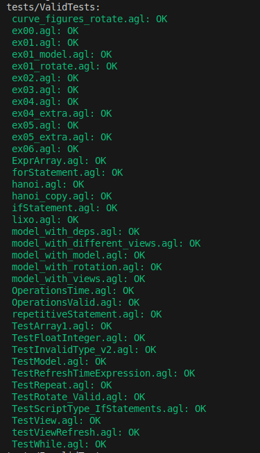
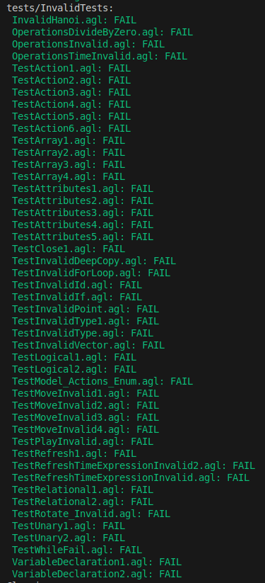

# AGLSemanticCheck

## Descrição

Implementação de um analisador semântico para a linguagem de programação AGL (`Animated Graphics Language`). O analisador semântico é responsável por verificar a correção semântica dos programas escritos em AGL, garantindo que não existam erros que passem despercebidos pela análise sintática.

## Estrutura do Projeto

- [`../src/`](../src/): Diretório contendo o código fonte.
  - [`AGLSemanticCheck.java`](../src/AGLSemanticCheck.java): Implementação do analisador semântico.
  - [`tests/`](../src/tests/): Diretório contendo os testes.
    - [`ValidTests/`](../src/tests/ValidTests/): Contém exemplos de programas AGL válidos.
    - [`InvalidTests/`](../src/tests/InvalidTests/): Contém exemplos de programas AGL com erros semânticos.
    - [`run-tests.sh`](../src/tests/run-tests.sh): Script shell para executar todos os testes.

## Verificações Semânticas Realizadas

O analisador semântico verifica os seguintes aspectos:

### 1. **Declaração de Variáveis**:
   - As variáveis devem ser declaradas antes de serem utilizadas.
   - Não pode haver repetições nas declarações de variáveis.
   - Não podem ser declaradas variáveis com nomes reservados.

Por exemplo, no ficheiro presente em [`InvalidTests/VariableDeclaration1.agl`](../src/tests/InvalidTests/VariableDeclaration1.agl), temos um exemplo onde foi definida uma variável como Number e posteriormente foi tentado atribuir-lhe um valor do tipo String. O analisador semântico deteta este erro.

**Exemplo de `VariableDeclaration1.agl`:**
```agl
cellSize : Number = 200;

cellSize = 250; # OK

cellSize = "Joao"; # Error. Expression type does not conform to variable type!
```

Por outro lado, o analisador também deteta se o utilizador tentar definir uma variável que já se encontra declarada, reportando o erro, como no ficheiro [`InvalidTests/VariableDeclaration2.agl`](../src/tests/InvalidTests/VariableDeclaration2.agl).

**Exemplo de `VariableDeclaration2.agl`:**
```agl
cellSize : Number = 200;

cellSize : String = "Joao"; # Error. Variable "cellSize" already declared!
```

Já no exemplo [`InvalidTests/TestInvalidId.agl`](../src/tests/InvalidTests/TestInvalidId.agl), é declarada uma variável com nome 'length' porém esta não pode ser aceite porque já está reservada para ser utilizada na criação de tipos como Rectangle, Ellipse, etc. O analisador semântico deteta este erro e reporta-o.

**Exemplo de `TestInvalidId.agl`:**
```agl
length : Number = 200; # Error: variable name "length" is a reserved word!
```


### 2. **Atribuições e Operações**:
   - Verificação da validade das atribuições e operações entre variáveis.
   - Garantia de que os tipos de dados são compatíveis nas operações.

Por exemplo, o ficheiro [`ValidTests/OperationsValid.agl`](../src/tests/ValidTests/OperationsValid.agl) contém exemplos de operações válidas, como a soma de um ponto com um vetor, a multiplicação de um ponto por um inteiro, e a comparação entre um float e um inteiro com o mesmo valor.

**Exemplo de `ValidTests/OperationsValid.agl`:**
```agl
t1 : Point = (1,3)+(3:4); # Works, we can add a point with a vector

t5: Point = 2*(1,3); # Works, we can multiply a point by an integer

t6: Point = (1,3)*2; # Works, we can multiply a point by an integer

t9: Number = (1:3)*(3:4) + 2; # Works, we can multiply two vectors

t10: Boolean = 2.0 == 2; # Works, we can compare a float with an integer
```

Por outro lado, o ficheiro [`InvalidTests/OperationsInvalid.agl`](../src/tests/InvalidTests/OperationsInvalid.agl) contém exemplos de operações inválidas, como a tentativa de somar um ponto com um inteiro, a soma de dois pontos, ou a divisão de dois vetores. Nestes casos, o analisador semântico deteta e sinaliza os erros, garantindo que apenas operações válidas sejam permitidas no código AGL.

**Exemplo de `InvalidTests/OperationsInvalid.agl`:**
```agl
t2 : Point = (1,3)+3; # Error! we cannot add a point with an integer
 
t3: Point = (1,3)+(3,4); # Error! we cannot add two points

t4: Point = 2/(1,3); # Error! we cannot divide an integer by a point

t7: Vector = (1:3)*(3:4); # Error! Multiplying two vectors results in a number

t8: Vector = (1:3)/(3:4); # Error! we cannot divide two vectors
```

O analisador também verifica as operações entre variáveis do tipo 'Time', assegurando que estas sejam válidas. Por exemplo, no ficheiro [`ValidTests/OperationsTime.agl`](../src/tests/ValidTests/OperationsTime.agl), operações entre variáveis do tipo Time resultam numa variável do tipo 'Time'. No entanto, operações entre variáveis do tipo Integer ou Number com variáveis do tipo Time resultam numa variável do tipo Number.

**Exemplo de `ValidTests/OperationsTime.agl`:**
```agl
t1 : Time = 0.8;

t2 : Time = 0.5;

t3 : Time = t1 + t2; # OK

t4 : Time = t1 - t2; # OK

t5 : Time = t1 * t2; # OK

t6 : Time = t1 / t2; # OK

t7 : Integer = 5; 

t8 : Number = 3.3;

t9 : Number = t1 + t7; # OK

t10 : Number = t1 + t8; # OK
```

No ficheiro [`InvalidTests/OperationsTimeInvalid.agl`](../src/tests/InvalidTests/OperationsInvalid.agl), foram realizadas tentativas de operações inválidas entre variáveis do tipo Time e variáveis de outros tipos, como String, e o analisador semântico detetou corretamente os erros.

**Exemplo de `InvalidTests/OperationsTimeInvalid.agl`:**
```agl
t1 : Time = 0.8;

t2 : String = "joao";

t5 : Time = t1 + t2; # Error: invalid type in arithmetic operation!

t6 : Time = t1 * t2; # Error: invalid type in arithmetic operation!
```

Além das operações mencionadas anteriormente, o analisador semântico também reporta um erro caso seja feita uma operação de divisão por zero, como é possível verificar no ficheiro [`InvalidTests/OperationsDivideByZero.agl`](../src/tests/InvalidTests/OperationsDivideByZero.agl).

**Exemplo de `InvalidTests/OperationsDivideByZero.agl`:**
```agl
a : Number = 3.0;
b : Number = a / 0; # Error: division by zero!
```

### 3. **Propriedades dos Arrays**:
   - Consistência de Tipos de Arrays: verificação para garantir que o tipo de array a atribuir coincide com o tipo declarado.

Por exemplo, os ficheiros [`InvalidTests/TestArray{1,2,3,4}.agl`](../src/tests/InvalidTests/TestArray1.agl) contêm vários exemplos que ilustram estas verificações. No ficheiro [`InvalidTests/TestArray1.agl`](../src/tests/InvalidTests/TestArray1.agl), tentou-se definir a variável "c" como um Array de Strings, mas como esta variável era um Array de um Array de Pontos, o analisador semântico detetou o erro. Outro exemplo, no ficheiro [`InvalidTests/TestArray2.agl`](../src/tests/InvalidTests/TestArray2.agl), mostra uma tentativa de atribuir um valor do tipo String a um elemento de um Array de Pontos, que também foi corretamente identificado como erro pelo analisador.

**Exemplo de `InvalidTests/TestArray1.agl`:**
```agl
c : Array<Array<Point>> = [[(1,2), (3,4)], [(1,2), (3,4)]]; # correct.

c = ["a","b","c","d","e"]; # Error. Type: Array<Array<Point>> ; Assignment Type: Array<String>
```

**Exemplo de `InvalidTests/TestArray2.agl`:**
```agl
c : Array<Array<Point>> = [[(1,2), (3,4)], [(1,2), (3,4)]]; # correto.

c[0] = "a"; # Error. Type: Array<Point> ; Assignment Type: String
```

No ficheiro [`InvalidTests/TestArray4.agl`](../src/tests/InvalidTests/TestArray4.agl), foram realizados diversos testes para verificar a consistência dos tipos de arrays atribuídos. Testou-se a atribuição correta e incorreta de valores a arrays de arrays de pontos, verificando-se que o analisador semântico deteta e sinaliza os erros adequadamente.

**Exemplo de `InvalidTests/TestArray4.agl` (não foram incluídos todos os exemplos):**
```agl
c : Array<Array<Point>> = [[(1,2), (3,4)], [(1,2), (3,4)]]; # correct.

...

e : Array<Array<Array<Point>>> = [c, c, c, c]; # correct.

f : Array<Array<Array<Point>>> = [c, c[0], c, c]; # Error: c[0] is of type Array<Point>, should be of type Array<Array<Point>>.

```

No ficheiro [`ValidTests/TestArray1.agl`](../src/tests/ValidTests/TestArray1.agl), encontram-se atribuições válidas como, por exemplo: atribuição de um array de inteiros; atribuição de um array de arrays de pontos, etc.

**Exemplo de `ValidTests/TestArray1.agl`:**
```agl
a : Array<Integer> = [0,2,3,4,5]; # correct.

b : Array<String> = ["a","b","c","d","e"]; # correct.

c : Array<Array<Point>> = [[(1,2), (3,4)], [(1,2), (3,4)]]; # correct.

c = [ [(1,2), (3,4), (5,6), (7,8), (9,10)] , [(1,2), (3,4), (5,6), (7,8), (9,10)] ]; # correct.

e : Array<Array<Array<Point>>> = [c, c, c, c]; # correct.

i : Array<Array<Point>> = [c[0], c[1]]; # correct.
```


### 4. **Propriedades dos Points e dos Vectors:**
   - Verificação dos tipos introduzidos num Point e num Vector.

No ficheiro [`InvalidTests/TestInvalidPoint.agl`](../src/tests/InvalidTests/TestInvalidPoint.agl), tentou-se definir um Point com um valor do tipo String, o que é inválido, e o erro é corretamente detetado pelo analisador semântico.
De forma semelhante, se tentarmos definir um Vector com um valor do tipo String, o analisador semântico também deteta o erro, como é possível verificar no ficheiro [`InvalidTests/TestInvalidVector.agl`](../src/tests/InvalidTests/TestInvalidVector.agl).

**Exemplo de `InvalidTests/TestInvalidPoint.agl`:**
```agl
abc : Point = (1,"abc"); # Error. Requires numeric operands!
```

**Exemplo de `InvalidTests/TestInvalidVector.agl`:**
```agl
abc : Vector = (1,"abc"); # Error. Requires numeric operands!
```


### 5. **Propriedades dos Objetos**:
   - Verificação de Propriedades Válidas: O analisador semântico verifica se as propriedades atribuídas aos objetos gráficos existem e são válidas.
   - Verificação de Valores Válidos: o analisador garante que os valores atribuídos a estas propriedades sejam válidos e compatíveis com o esperado.

Por exemplo, os ficheiros [`InvalidTests/TestAttributes{1,2,3}.agl`](../src/tests/InvalidTests/TestAttributes1.agl) contêm exemplos que ilustram estas verificações. 
No ficheiro [`InvalidTests/TestAttributes1.agl`](../src/tests/InvalidTests/TestAttributes1.agl), tentou-se definir uma propriedade fill2 para um retângulo, mas esta propriedade não existe, e o analisador semântico detetou o erro. 
Outro exemplo, no ficheiro [`InvalidTests/TestAttributes2.agl`](../src/tests/InvalidTests/TestAttributes2.agl), mostra uma tentativa de atribuir um valor inválido à propriedade fill, isto é, uma cor inválida, o que também foi identificado como erro pelo analisador. 
Já no ficheiro [`InvalidTests/TestAttributes3.agl`](../src/tests/InvalidTests/TestAttributes3.agl), tentou-se definir a propriedade 'state' para um retângulo como "super", mas esta propriedade não é válida, e o erro foi corretamente detetado pelo analisador.

**Exemplo de `InvalidTests/TestAttributes1.agl`:**
```agl
cellSize : Number = 200;

Rectangle at (0,cellSize) with {
    length = (50,50);
    fill2 = "orange"; # Error: attribute fill2 does not exist
}
```

**Exemplo de `InvalidTests/TestAttributes2.agl`:**
```agl
cellSize : Number = 200;

Rectangle at (0,cellSize) with {
    length = (50,50);
    fill = "orangeaaaaa"; # Error: invalid color
}
```

**Exemplo de `InvalidTests/TestAttributes3.agl`:**
```agl
cellSize : Number = 200;

Rectangle at (0,cellSize) with {
    length = (50,50);
    state = "super"; # Error. State can only be "hidden" or "normal"
}
```

Esses exemplos mostram como o analisador semântico identifica propriedades inválidas e valores incompatíveis.


### 6. **Operação de refresh/close**:
   - Tipo de ID em Refresh/Close: Todas as IDs usadas nas operações de refresh e close devem ser do tipo View.
   - Expressão de Tempo em Refresh: No caso da operação refresh, a expressão após after deve ser do tipo Integer, Number ou uma variável do tipo Time garantindo que o valor temporal fornecido seja válido.
   - Ação em cadeia: Ambas estas operações permitem um uso em 'cadeia' (por exemplo, refresh view1, view2), mantendo a lógica de que apenas se pode fazer refresh ou close de Views.

Por exemplo, os ficheiros [`InvalidTests/TestRefresh1.agl`](../src/tests/InvalidTests/TestRefresh1.agl) e [`InvalidTests/TestClose1.agl`](../src/tests/InvalidTests/TestClose1.agl) contêm exemplos que ilustram estas verificações. No ficheiro [`InvalidTests/TestRefresh1.agl`](../src/tests/InvalidTests/TestRefresh1.agl), a operação refresh é aplicada corretamente a uma variável do tipo View, mas falha ao ser aplicada a uma variável do tipo Integer, sendo este erro corretamente detetado pelo analisador semântico. De maneira similar, no ficheiro [`InvalidTests/TestClose1.agl`](../src/tests/InvalidTests/TestClose1.agl), a operação close é corretamente aplicada a uma View, mas um erro é detetado quando se tenta aplicar close a uma variável do tipo Integer.

**Exemplo de `InvalidTests/TestRefresh1.agl`:**
```agl
view : View with {
    Ox = -450;
    Oy = 0;
    width = 401;
    height = 401;
    title = "Illustrating a moving pacman";
    background = "alice blue";
}

refresh view; # works

a : Integer = 2;

refresh a; # Error: invalid type in refresh command (must be a view type!)
```

**Exemplo de `InvalidTests/TestClose1.agl`:**
```agl
# create an instance of a View, at the beginning of the strip
view : View with {
    Ox = -450;
    Oy = 0;
    width = 401;
    height = 401;
    title = "Illustrating a moving pacman";
    background = "alice blue";
}

close view;

a : Integer = 0;

close a; # Error: invalid type in close command (must be a view type!)
```

Relativamente à expressão de tempo em Refresh, o ficheiro [`ValidTests/TestRefreshTimeExpression.agl`](../src/tests/ValidTests/TestRefreshTimeExpression.agl) contém um exemplo que ilustra esta verificação. Neste ficheiro, temos duas operações refresh, uma com uma expressão de tempo do tipo Number e outra com uma expressão de tempo do tipo Time, ambas corretamente verificadas pelo analisador semântico.

**Exemplo de `ValidTests/TestRefreshTimeExpression.agl`:**
```agl
t : Time = 0.5;

for i in 1 .. 10 do {
    pacman.mouth = Close;
    refresh view after 20 ms;
    pacman.mouth = Open;
    refresh view after 25.3 ms; # the refresh works with integers and floats
    refresh view after t ms; # the refresh works with variables of type Time
    move pacman by (10,0);  
    move view by (10,0); 
    refresh view;
}
```

Por outro lado, no ficheiro [`InvalidTests/TestRefreshTimeExpressionInvalid.agl`](../src/tests/InvalidTests/TestRefreshTimeExpressionInvalid.agl), a expressão de tempo após after é do tipo String, o que é inválido, e o erro é corretamente detetado pelo analisador semântico.

**Exemplo de `InvalidTests/TestRefreshTimeExpressionInvalid.agl`:**
```agl
t : String = "joao";

for i in 1 .. 10 do {
    pacman.mouth = Close;
    refresh view after 20 ms;
    pacman.mouth = Open;
    refresh view after 25 ms; 
    refresh view after t ms; # Error: invalid type in time expression (must be Integer, Number, or Time)
    move pacman by (10,0);
    move view by (10,0); 
    refresh view;
}
```

O analisador também não permite que seja feita a operação refresh com um valor negativo, como é possível verificar no ficheiro [`InvalidTests/TestRefreshTimeExpressionInvalid2.agl`](../src/tests/InvalidTests/TestRefreshTimeExpressionInvalid2.agl).

**Exemplo de `InvalidTests/TestRefreshTimeExpressionInvalid2.agl`:**
```agl
t : Time = 0.5;

for i in 1 .. 10 do {
    pacman.mouth = Close;
    refresh view after 20 ms;
    pacman.mouth = Open;
    refresh view after -25.3 ms; # Error: time value cannot be negative
    refresh view after t ms; 
    move pacman by (10,0); 
    move view by (10,0);  
    refresh view;
}
```


No ficheiro [`ValidTests/hanoi.agl`](../src/tests/ValidTests/hanoi.agl), podemos confirmar, na linha 170 que é possível fazer uma ação de refresh em cadeia. Podemos ainda confirmar que o uso destas expressões apenas para Views se mantém fiel, no exemplo [`InvalidTests/hanoi.agl`](../src/tests/InvalidTests/hanoi.agl). Neste exemplo, a variável 'hasValues' é do tipo Boolean, e o analisador semântico deteta corretamente o erro.


**Exemplo de `InvalidTests/InvalidHanoi.agl`:**
```agl
        hasValues : Boolean = False;

        (...)       

        refresh view1, view2, view3, hasValues;
```


### 7. **Operação de move**:
   - Tipos de ID em Move: Os IDs usados na operação de move podem ser objetos, do tipo model ou do tipo view.
   - Uso de "by" e "to": Quando a operação move utiliza by, deve ser seguida por um Point ou um Vector, permitindo movimentos relativos. Quando a operação move utiliza to, deve ser seguida por um elemento do tipo Point, especificando uma posição absoluta para o movimento.

Por exemplo, o ficheiro [`InvalidTests/TestMoveInvalid1.agl`](../src/tests/InvalidTests/TestMoveInvalid1.agl) contém um exemplo que ilustra esta verificação. Neste ficheiro, a operação move é aplicada a um Point, mas isso é inválido, pois Point não é considerado um objeto. Este erro é corretamente detetado pelo analisador semântico.

**Exemplo de `InvalidTests/TestMoveInvalid1.agl`:**
```agl
print "Press any mouse button to quit";
pos : Point = wait mouse click; # instantiate a Point and waits for a mouse click

move pos to (0,0); # Error. Cannot move a Point to a position
```

Por exemplo, no ficheiro [`InvalidTests/TestMoveInvalid2.agl`](../src/tests/InvalidTests/TestMoveInvalid2.agl), a operação de move é realizada com um valor do tipo String, o que é inválido, e o erro é corretamente detetado pelo analisador semântico.

**Exemplo de `InvalidTests/TestMoveInvalid2.agl`:**
```agl
for i in 1 .. 10 do {
    pacman.mouth = Closed;
    refresh view after 20 ms;
    pacman.mouth = Open;
    refresh view after 25 ms;
    move pacman by (10,0);    # the 'by' makes the movement relative; the argument is a vector
    move view by "Joao";    # Error: invalid expression type in move command (must be a point or a vector!)
    refresh view;
}
```


### 8. **Verificação de estruturas de repetição:**
   - Verificação de expressões condicionais: O analisador semântico assegura que as expressões condicionais utilizadas nas estruturas de repetição (`while`, `repeat`) sejam válidas e do tipo booleano.

Por exemplo, o ficheiro [`ValidTests/TestWhile.agl`](../src/tests/ValidTests/TestWhile.agl) demonstra exemplos de verificações válidas para as estruturas de repetição. Neste ficheiro, as condições dentro das instruções `while` são corretamente verificadas pelo analisador semântico para garantir que sejam do tipo booleano.

**Exemplo de `ValidTests/TestWhile.agl`:**
```agl
while 1==1 do {   # valid boolean condition 
    a: Integer = 1;
}

b: Integer;

while 2>1 do {    # valid boolean condition 
    b = 2;
}
```

Para além disso, foi criado um exemplo [`InvalidTest/TestWhileFail.agl`](../src/tests/InvalidTests/TestWhileFail.agl), que contém exemplos de estruturas `while` com expressões inválidas, como a expressão 'abc', que não é do tipo booleano. Estes testes ilustram a capacidade do analisador semântico de detetar erros em expressões condicionais inválidas.

**Exemplo de `InvalidTest/TestWhileFail.agl`:**
```agl
b: Integer;

while abc do {    # invalid boolean condition
    b = 2;
}
```

Adicionalmente, foi criado o teste [`ValidTest/TestRepeat.agl`](../src/tests/ValidTests/TestRepeat.agl), que serve como exemplo de verificação bem-sucedida nas estruturas de repetição `repeat`. Da mesma forma que a condição é analisada para ser do tipo booleano na estrutura `while`, ela também é avaliada da mesma maneira nesta estrutura.

**Exemplo de `ValidTest/TestRepeat.agl`:**
```agl
repeat {
    a: String = "programming";
} until a == "agl";     # valid boolean condition 

```


### 9. **Verificação das estruturas de ação:**
   - Verificação de elementos: É assegurado que dentro de uma action apenas podem ser englobadas ações com atributos previamente definidos dentro do Model.
   - Verificação de Instantiation: É também assegurado que não pode ser feita uma instanciação dentro de uma action.
   - Verificação de atributos: É assegurado também que é impossível fazer uma atribuição com um tipo de valores incorreto, ou a uma variável que não exista.

Por exemplo nos ficheiros [`InvalidTests/TestAction1.agl`](../src/tests/InvalidTests/TestAction1.agl), [`InvalidTests/TestAction2.agl`](../src/tests/InvalidTests/TestAction2.agl), [`InvalidTests/TestAction3.agl`](../src/tests/InvalidTests/TestAction3.agl) é possível confirmar que é impossível fazer uma action em atributos que não existem (TestAction1 e TestAction3) ou ainda em variáveis definidas fora do Model (TestAction3).

**Exemplo de `../src/tests/TestInvalid/TestAction1.agl`:**

```agl
(...)
    face : PieSlice at (0,0) with {
        length = (50,50);
        fill = "pink";
        start = 30;
        extent = 300;
    }  

(...)
    action on face.asaafs { # Error: invalid action
        if mouth == Open do
            with face do {
                start = 30;
                extent = 300;
            }

(...)
```

No ficheiro [`InvalidTests/TestAction5.agl`](../src/tests/InvalidTests/TestAction5.agl) confirmámos a impossibilidade de fazer uma instanciação dentro da Action.

**Exemplo de `../src/tests/TestInvalid/TestAction5.agl`:**

```agl
    action on mouth { 
        # Error: instantiation is not allowed inside an action
        fire : PieSlice at (0,0) with {
            length = (50,50);
        }

(...)
```

No ficheiro [`InvalidTests/TestAction4.agl`](../src/tests/InvalidTests/TestAction4.agl) outline não é um atributo do PieSlice face, logo é uma atribuição inválida. Também no ficheiro [`InvalidTests/TestAction6.agl`](../src/tests/InvalidTests/TestAction6.agl) podemos confirmar que é inválido fazer uma atribuição à variável 'length' com um valor incorreto (deveria ser um Point).

**Exemplo de `../src/tests/TestInvalid/TestAction6.agl`:**

```agl
    face : PieSlice at (0,0) with {
        length = (50,50);
        fill = "pink";
        start = 30;
        extent = 300;
    }

(...)

    action on mouth { 
        face.length = "aa"; # Error. Expression type does not conform to variable type!

(...)
```


### 10. **Verificação dos atributos dos ObjectType**:
   - Verificação dos atributos: Para cada ObjectType (por exemplo "Blob", "Arc", ...) foi feita uma verificação dos possíveis atributos nessas estruturas.
   - Verificação das atribuições de variáveis: Para cada atribuição feita dentro de um ObjectType (por exemplo "outline", "fill", ...) foi feita uma verificação do tipo de variável possível para essa verificação.

Por exemplo, o ficheiro [`InvalidTests/TestAttributes5.agl`](../src/tests/InvalidTests/TestAttributes5.agl) demonstra que o atributo "origin" não é válido para a criação de uma View, e o analisador semântico deteta este erro.

**Exemplo de `InvalidTests/TestAttributes5.agl`:**
```agl
view : View with {
    Ox = -450;
    Oy = 0;
    width = 401;
    height = 401; 
    title = "Illustrating a moving pacman";
    background = "alice blue";
    origin = (100, 100);   # invalid attribute for creating a view
}
```
O analisador semântico também verifica se as variáveis atribuídas a um ObjectType são do tipo correto.
Por exemplo, o ficheiro [`InvalidTests/TestAttributes4.agl`](../src/tests/InvalidTests/TestAttributes4.agl) contém um exemplo onde a altura ('height') é atribuída a um ObjectType com um valor do tipo Point, o que é inválido, e o erro é corretamente detetado pelo analisador semântico.

**Exemplo de `InvalidTests/TestAttributes4.agl`:**
```agl
view : View with {
    Ox = -450;
    Oy = 0;
    width = 401;
    height = (401, 401);   # height cannot be of point type
    title = "Illustrating a moving pacman";
    background = "alice blue";
}
```


### 11. **Verificação dos Operadores +, -, not**:
   - **Verificação dos Operadores**: Para cada operador (`+`, `-`, `not`), o analisador semântico verifica os tipos de variáveis que podem ser utilizados com esses operadores.

O analisador semântico reporta um erro se o operador `not` for utilizado com um tipo de variável que não seja booleano. Por exemplo, no ficheiro [`InvalidTests/TestUnary1.agl`](../src/tests/InvalidTests/TestUnary1.agl), o operador `not` é aplicado a uma variável do tipo `Integer`, o que é inválido, e o erro é corretamente detetado pelo analisador semântico.

Quando são utilizados os operadores `+` e `-`, o analisador verifica se o tipo de dado é compatível para operações unárias. Os tipos válidos incluem tipos numéricos, `Point`, `Vector` e `BooleanType`. Se o tipo não for um desses, o analisador reporta um erro. Por exemplo, no ficheiro [`InvalidTests/TestUnary2.agl`](../src/tests/InvalidTests/TestUnary2.agl), o operador `-` é aplicado a uma variável do tipo `String`, o que é inválido, e o erro é corretamente detetado pelo analisador semântico.

#### Exemplos:

**Exemplo de `InvalidTests/TestUnary1.agl`:**
```agl
x : Integer = 5;
y : Boolean = not x; # Error: The 'not' operator requires a boolean operand!
```

**Exemplo de `InvalidTests/TestUnary2.agl`:**
```agl
x : String = "hello";
y : String = -x; # Error: Not an unary type!
```

### 12. **Verificação dos Operadores 'and' e 'or'**:
   - **Verificação dos Operadores**: Para os operadores `and` e `or`, o analisador semântico verifica se ambos os operandos são do tipo booleano.

O analisador semântico reporta um erro se os operadores `and` ou `or` forem utilizados com operandos que não sejam booleanos. Por exemplo, no ficheiro [`InvalidTests/TestLogical1.agl`](../src/tests/InvalidTests/TestLogical1.agl), o operador `and` é aplicado a uma variável do tipo `Boolean` e uma variável do tipo `Integer`, o que é inválido, e o erro é corretamente detetado pelo analisador semântico.

Da mesma forma, se o operador `or` for utilizado com operandos que não sejam booleanos, o analisador reporta um erro. Por exemplo, no ficheiro [`InvalidTests/TestLogical2.agl`](../src/tests/InvalidTests/TestLogical2.agl), o operador `or` é aplicado a duas variáveis, uma do tipo `Boolean` e outra do tipo `String`, o que também é inválido.

#### Exemplos:

**Exemplo de `InvalidTests/TestLogical1.agl`:**
```agl
x : Boolean = true;
y : Integer = 5;
z : Boolean = x and y; # Error: Both operands of 'and' must be boolean!
```

**Exemplo de `InvalidTests/TestLogical2.agl`:**
```agl
a : Boolean = false;
b : String = "hello";
c : Boolean = a or b; # Error: Both operands of 'or' must be boolean!
```

Esta verificação assegura que os operadores lógicos `and` e `or` sejam utilizados corretamente apenas com operandos booleanos, mantendo a integridade semântica do programa.


### 13. **Verificação do Simple Statement**
   - Verificação do tipo: Foi verificado que num simple statement o 'typeID' definido era válido, isto é, tinha de ser um tipo pré-definido (como por exemplo Blob, Integer, Spline, ...).
   - Verificação da expressão: Uma expressão (quando se define o lugar dessa variável) tem de ser do tipo Ponto.
   - Verificação de um assignment: Se for feito um assignment, este tem de estar em conformidade com o tipo do statement.

Como se confirmar no ficheiro [`InvalidTests/TestInvalidType.agl`](../src/tests/InvalidTests/TestInvalidType.agl), é impossível fazer uma instanciação com um tipo 'Integere' visto que não é um tipo válido.

**Exemplo de `../src/tests/TestInvalid/TestInvalidType.agl`:**

```agl
a: Integere = 0;
```

Por exemplo, no ficheiro [`InvalidTests/TestInvalidType1.agl`](../src/tests/InvalidTests/TestInvalidType1.agl) à variável 'a' que é do tipo Integer, não é possível atribuir-lhe o valor "aa" que é uma String.

**Exemplo de `../src/tests/TestInvalid/TestInvalidType1.agl`:**

```agl
a: Integer = "aa";
```


### 14. **Verificação dos If Statements**
   - Tipo da expressão: A expressão dentro de um if statement tem de ser do tipo booleano.
   - Stat: Dentro de cada stat (isto é, dentro de cada bloco de 'if' ou 'else') não pode existir uma expressão vazia.

Por exemplo, no ficheiro [`InvalidTests/TestInvalidIf.agl`](../src/tests/InvalidTests/TestInvalidIf.agl), podemos observar que não podemos definir usar uma String para definir a expressão dentro do if.

**Exemplo de `../src/tests/TestInvalid/TestInvalidIf.agl`:**

```agl
# Error: the expression in the if statement has to be a boolean
if "ABC" do 
{
    print "Hello";
}          
else do
    print "nao imprime :(";
    print "imprime :)";  
```

### 15. **Verificação dos ciclos For**
   - Declaração da variável: Dentro de um ciclo for, não podemos usar uma variável que já tenha sido previamente declarada.

   - Verificação do ciclo for: Dentro do loop, não pode ser permitida a definição do range com elementos que não sejam inteiros.

   - Stat: Não pode haver uma expressão vazia dentro de um ciclo for.

Por exemplo, o ficheiro [`InvalidTests/TestInvalidForLoop.agl`](../src/tests/InvalidTests/TestInvalidForLoop.agl), onde podemos confirmar que não é possível definir um range com uma String.

**Exemplo de `../src/tests/TestInvalid/TestInvalidForLoop.agl`:**

```agl
# Error: invalid expression type in for statement (must be integer!)
for i in "aa" .. 10 do {
    print "AA";
}
```


### 16. **Operação de rotate**
- Verificação dos tipos de objetos permitidos a utilizarem a funcionalidade `rotate`.

Por exemplo, no ficheiro [`ValidTests/curve_figures_rotate.agl`](../src/tests/ValidTests/curve_figures_rotate.agl) foram criados diversos objetos diferentes que podem utilizar esta funcionalidade. Por outro lado, no ficheiro [`InvalidTests/TestRotate_Invalid.agl`](../src/tests/InvalidTests/TestRotate_Invalid.agl), há a tentativa de fazer `rotate` de uma 'View', o que não é semanticamente correto na linguagem AGL e que é corretamente identificado pelo analisador.

**Exemplo de `ValidTests/curve_figures_rotate.agl`:**

```agl
elipse : Ellipse at (-750, 0) with {
    (...)
}

arc : Arc at (-550, 0) with {
    (...)
}

arcchord : ArcChord at (-350, 0) with {
    (...)
}

pieslice : PieSlice at (-150, 0) with {
    (...)
}

view : View with {
    (...)
}
refresh view;

for i in 0..5 do {
    rotate elipse by 35;
    rotate arc by 35;
    rotate arcchord by 35;
    rotate pieslice by 35;
    refresh view after 1s;
}
```

**Exemplo de `InvalidTests/TestRotate_Invalid.agl`:**

```agl
view : View with {
    Ox = -450;
    Oy = 0;
    width = 401;
    height = 401;
    title = "Illustrating a moving pacman";
    background = "alice blue";
}

rotate view by 0.1; # Error. Can't rotate views
```

### 17. **Expressão DeepCopy**
   - Tipo da expressão: O tipo da expressão tem de ser obrigatoriamente um ponto, uma vez que apenas se pode fazer uma cópia para um determinado ponto (não se pode copiar um elemento para uma String, por exemplo).

Como podemos observar no ficheiro [`InvalidTests/TestInvalidDeepCopy.agl`](../src/tests/InvalidTests/TestInvalidDeepCopy.agl) não é permitido fazer uma 'deepcopy' para um valor do tipo Integer.

**Exemplo de `../src/tests/InvalidTests/TestInvalidDeepCopy.agl`:**

```agl
Pacman :: Model {

(...)

pacman : Pacman at (-450, 0);

move pacman by (0,100);

pacman2 : Pacman = deepcopy pacman to 200; # Error: invalid expression type in deepcopy command (must be point!)
```

### 18. **Operação de play**
   - Verificação do tipo de objeto permitido na operação `play`.

A operação `play` apenas pode ser utilizada com objetos do tipo `Script`. Se tentarmos utilizar esta operação com um objeto de outro tipo, o analisador semântico deteta o erro.
Por exemplo, no ficheiro [`InvalidTests/TestPlayInvalid.agl`](../src/tests/InvalidTests/TestPlayInvalid.agl) tentou-se utilizar a operação `play` com um objeto do tipo `Number`, o que é inválido e é corretamente detetado pelo analisador.

**Exemplo de `InvalidTests/TestPlayInvalid.agl`:**

```agl
(...)
s1 : Number = 100;  # Error: identifier "s1" is not a script type
play s1 with {
    m = pacman;
    v = view;
}

(...)
```

    
### 19. **Verificações de Expressões Relacionais (>, <, ==, etc.)**

O analisador semântico realiza várias verificações para garantir que as expressões relacionais (`>`, `<`, `>=`, `<=`, `==`, `!=`) sejam usadas corretamente e que os tipos de dados envolvidos sejam compatíveis. As verificações incluem:

- **Compatibilidade de Tipos**: Ambos os operandos numa expressão relacional devem ser do mesmo tipo ou tipos compatíveis.
- **Verificação de Tipos Especiais**: Certos tipos, como `EnumType`, `BooleanType`, `PointType`, e `VectorType`, têm regras específicas para uso em expressões relacionais.

#### Validações Realizadas pelo Analisador:

1. **Verificação de Tipos Compatíveis**:
   - Se ambos os operandos não são do mesmo tipo, a expressão relacional é inválida, a menos que uma das exceções abaixo se aplique.
   
2. **Exceções para Tipos Numéricos**:
   - Operandos do tipo `IntegerType` e `NumberType` são considerados compatíveis entre si.
   
3. **Verificação de Tipos Enumerados**:
   - Se um dos operandos é um `EnumType`, o outro deve ser um `EnumType` ou `EnumValueType` correspondente.
   - O valor do segundo operando deve estar na lista de 'enums' do primeiro operando.
   
4. **Tipos Booleanos e Expressões Relacionais**:
   - Expressões relacionais não são permitidas entre operandos booleanos.
   
5. **Tipos Ponto e Vetor**:
   - Expressões relacionais não são permitidas entre operandos do tipo `PointType` ou `VectorType`.

#### Exemplos:

No ficheiro [`InvalidTests/TestRelational1.agl`](../src/tests/InvalidTests/TestRelational1.agl), tentou-se comparar um inteiro com um booleano, o que é inválido, e o erro é corretamente detetado pelo analisador semântico.

Considerámos que não faria sentido comparar pontos nem vectores. Por exemplo, no ficheiro [`InvalidTests/TestRelational2.agl`](../src/tests/InvalidTests/TestRelational2.agl), tentou-se comparar dois pontos e o erro foi detetado.

**Exemplo de `InvalidTests/TestRelational1.agl`:**
```agl
x : Integer = 5;
y : Boolean = True;
z : Boolean = x > y; # Error: must be the same type in relational expression!
```

**Exemplo de `InvalidTests/TestRelational2.agl`:**
```agl
a : Point = (1, 2);
b : Point = (3, 4);
c : Boolean = a > b; # Error: invalid relational expression (point or vector type)
```


Essas validações garantem que as expressões relacionais no código sejam semanticamente corretas, prevenindo erros de tipo e garantindo a integridade do programa.

## Executar

Dentro do diretório `src`: 

- Se pretender executar o analisador semântico para um ficheiro AGL específico, siga os passos abaixo:

1. Compile o projeto antlr4:
   ```sh
   antlr4-build
   ```
2. Execute o analisador semântico para o ficheiro AGL:
   ```
   cat tests/ValidTests/ex00.agl | antlr4-run
   ```

- Se pretender executar a bateria de testes, siga os passos abaixo:

3. Execute o script de testes:
   ```sh
   ./tests/run-tests.sh
   ```
O script irá executar todos os testes presentes nos diretórios `ValidTests` e `InvalidTests`, verificando se o comportamento esperado é obtido. Através da execução do script, é possível verificar se o analisador semântico está a detetar corretamente os erros semânticos nos programas AGL.

Como podemos ver, o analisador semântico deteta tanto os programas válidos como os inválidos, reportando os erros encontrados. Neste caso, os programas válidos não apresentam erros (`OK`), enquanto os programas inválidos apresentam erros semânticos, estando portanto sinalizados com `FAIL`.

<div style="display: flex; justify-content: space-around;">
  
  
</div>